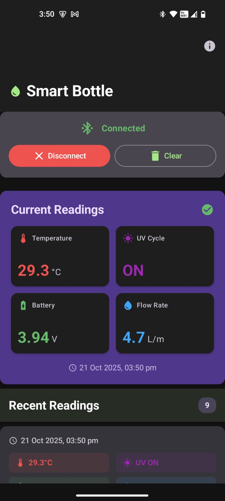

# Smart Bottle IoT System

A comprehensive Internet of Things (IoT) solution designed for real-time monitoring of water bottle parameters including temperature measurement, UV sterilization cycle status, battery voltage levels, and flow rate detection. The system architecture comprises an ESP32-based embedded hardware device featuring an integrated OLED display and a native Android companion application that enables wireless data transmission and visualization through Bluetooth Low Energy (BLE) communication protocol.

## System Features

### Hardware Capabilities
- **Multi-Parameter Monitoring**: Continuous measurement of temperature (Celsius), UV sterilization cycle status (binary state), battery voltage levels (volts), and liquid flow rate (liters per minute)
- **Integrated Display System**: 128x64 pixel monochrome OLED display providing real-time visualization of sensor data and system status
- **Wireless Communication**: Bluetooth Low Energy (BLE) 4.0+ connectivity enabling low-power wireless data transmission to compatible mobile devices
- **Temporal Synchronization**: Automatic time synchronization mechanism with connected mobile devices ensuring accurate timestamp correlation
- **Intelligent Reconnection**: Advanced reconnection algorithms with exponential backoff strategies and automatic device discovery upon connection loss

### Android Application Features
- **Modern User Interface**: Implementation of Material Design 3 specifications with adaptive theming, dynamic color schemes, and responsive layout design
- **Real-time Data Visualization**: Live sensor data streaming with automatic UI updates using reactive programming patterns and StateFlow architecture
- **Historical Data Management**: Persistent storage and retrieval system supporting up to 100 historical readings with timestamp indexing and chronological sorting
- **Device Management System**: Comprehensive BLE device discovery, connection management, and device state monitoring with visual status indicators
- **Cross-Platform Permission Handling**: Adaptive permission management system supporting Android API levels 24-36 with version-specific permission request strategies
- **Persistent Connection Management**: Automatic reconnection to previously paired devices with connection state persistence across application lifecycle events

## Application Interface Overview

The Android application provides a comprehensive user interface featuring:
- Real-time connection status monitoring with visual state indicators and error reporting
- Dynamic parameter display grid presenting temperature readings, UV cycle status, battery voltage, and flow rate measurements
- Chronological historical data presentation with formatted timestamps and parameter trending
- Bluetooth device discovery and selection interface with device identification and connection management
- Intelligent permission request handling with contextual explanations and fallback mechanisms

### Application Screenshots

#### Main Interface and Real-time Monitoring


The primary application interface displays real-time sensor data in an organized grid layout with Material Design 3 styling.

#### Device Connection and Management


Bluetooth device discovery and connection management interface with visual connection status indicators.

#### Historical Data Visualization


Chronological presentation of historical sensor readings with formatted timestamps and parameter trending.


## Video Demonstrations

### Case 1: ESP32 Paired to Mobile Device with Live Data Reading  
[Watch Demo](https://youtu.be/PDhdV3IJK7M)

### Case 2: Mobile Device Restarted While ESP32 Remains On  
[Watch Demo](https://www.youtube.com/watch?v=9OMV0pO7yD8)

### Case 3: ESP32 Powered Off and On After Pairing  
[Watch Demo](https://youtu.be/gn0D3X-ZWT0)

### Case 4: Both ESP32 and Mobile Device Powered Off Then On  
[Watch Demo](https://youtu.be/KK5QiKVi608)


## Hardware Requirements and Specifications

### Primary Microcontroller Unit
- **Processor**: ESP32 dual-core Tensilica Xtensa LX6 microprocessor with integrated Bluetooth Low Energy and Wi-Fi capabilities
- **Operating Frequency**: 240 MHz (dual-core) with dynamic frequency scaling support
- **Flash Memory**: Minimum 4MB external SPI flash memory for program storage and data logging
- **SRAM**: Minimum 520KB internal SRAM (320KB DRAM + 200KB IRAM) for runtime operations
- **Bluetooth Specification**: Bluetooth v4.2 BR/EDR and BLE compliance with integrated antenna
- **Operating Voltage**: 3.0V to 3.6V with integrated voltage regulators
- **GPIO Availability**: Minimum 30 programmable GPIO pins with multiple peripheral interfaces

### Required Electronic Components
- **Display Module**: SSD1306-based 128x64 pixel monochrome OLED display with I2C communication interface
- **Sensor Array**: Temperature measurement sensor (digital or analog), liquid flow rate sensor, UV LED status monitoring circuit
- **Power Management**: Battery voltage monitoring circuit with voltage divider network for ADC input
- **Communication Interface**: I2C bus implementation for display communication
- **Power Supply**: Regulated 3.3V power supply with adequate current capacity (minimum 500mA recommended)

### Hardware Interface Configuration
- **I2C Serial Data Line (SDA)**: GPIO 21 - Bidirectional data communication with OLED display
- **I2C Serial Clock Line (SCL)**: GPIO 22 - Clock signal generation for I2C protocol timing
- **OLED Reset Control**: Hardware reset not utilized (software reset implementation)
- **Power Distribution**: 3.3V VCC and common ground (GND) connections to all peripheral devices

### System Interconnection Schematic
```
ESP32 Development Board    SSD1306 OLED Display
GPIO 21 (SDA)         -->  SDA (Serial Data)
GPIO 22 (SCL)         -->  SCL (Serial Clock)
3.3V Power Rail       -->  VCC (Power Input)
Ground Reference      -->  GND (Ground)

Additional Sensor Connections:
Temperature Sensor    -->  GPIO (Analog/Digital Input)
Flow Rate Sensor      -->  GPIO (Digital Input/Interrupt)
UV Status Monitor     -->  GPIO (Digital Input)
Battery Monitor       -->  ADC Channel (Analog Input)
```

## Software Requirements and Dependencies

### Android Application Platform Requirements
- **Minimum SDK Version**: Android 7.0 Nougat (API Level 24) - Ensures compatibility with modern BLE implementations
- **Target SDK Version**: Android 14 (API Level 36) - Optimized for latest Android features and security enhancements
- **Compile SDK Version**: Android 14 (API Level 36) - Development compilation target with latest Android framework APIs
- **Supported Architectures**: ARM64-v8a (64-bit), ARMv7 (32-bit) - Comprehensive device compatibility across modern Android hardware
- **Runtime Requirements**: Android Runtime (ART) with minimum 2GB RAM recommended for optimal performance

### Required System Permissions
- **Legacy Bluetooth Permissions** (API ≤ 30):
  - `android.permission.BLUETOOTH` - Basic Bluetooth functionality access
  - `android.permission.BLUETOOTH_ADMIN` - Bluetooth adapter management and device discovery
- **Modern Bluetooth Permissions** (API 31+):
  - `android.permission.BLUETOOTH_SCAN` - BLE device discovery and scanning operations
  - `android.permission.BLUETOOTH_CONNECT` - BLE device connection and communication
- **Location-Based Permissions** (API 23-30):
  - `android.permission.ACCESS_FINE_LOCATION` - Required for BLE scanning on older Android versions
  - `android.permission.ACCESS_COARSE_LOCATION` - Coarse location access for BLE operations

### Development Environment Specifications
- **Integrated Development Environment**: Android Studio Flamingo (2022.2.1) or later with Kotlin support
- **Programming Language**: Kotlin 2.0.21 with coroutines and flow support for reactive programming
- **Build System**: Gradle Build Tool 8.12.3 with Kotlin DSL configuration
- **Java Development Kit**: OpenJDK 11 or Oracle JDK 11 with long-term support
- **Android Gradle Plugin**: Version 8.12.3 with R8 code shrinking and obfuscation support

### Embedded Firmware Development Requirements
- **Development Platform**: Arduino IDE 1.8.19 or later, alternatively PlatformIO IDE with ESP32 platform support
- **ESP32 Core Framework**: ESP-IDF v2.0.0 or later with Arduino framework compatibility layer
- **Compiler Toolchain**: Xtensa GCC cross-compiler with C++11 standard support

### Required Firmware Libraries and Dependencies
- **JSON Processing**: ArduinoJson library version 6.19.4 or later for efficient JSON serialization and parsing
- **Graphics Framework**: Adafruit GFX Library for graphics primitives and text rendering on OLED display
- **Display Driver**: Adafruit SSD1306 library for I2C communication with OLED display controller
- **Bluetooth Communication**: ESP32 BLE Arduino library (integrated with ESP32 core) for BLE server implementation
- **Wire Communication**: Wire library for I2C protocol implementation and device communication

## Installation and Configuration Procedures

### Embedded System Configuration

#### Arduino IDE Library Installation
Execute the following library installation procedure through the Arduino IDE Library Manager:

```bash
# Access Tools > Manage Libraries in Arduino IDE
# Search and install the following libraries with specified minimum versions:

ArduinoJson by Benoit Blanchon (≥6.19.4)
- Provides efficient JSON serialization and deserialization capabilities
- Enables structured data communication between ESP32 and Android application

Adafruit GFX Library by Adafruit (latest stable)
- Core graphics library providing drawing primitives and text rendering functions
- Foundation library for display operations and visual element rendering

Adafruit SSD1306 by Adafruit (latest stable)
- Hardware-specific driver for SSD1306 OLED display controller
- Implements I2C communication protocol and display buffer management

ESP32 BLE Arduino (integrated with ESP32 core package)
- Bluetooth Low Energy implementation for ESP32 microcontroller
- Provides BLE server functionality and characteristic management
```

#### Firmware Compilation and Upload Process
1. **Project Loading**: Open the firmware source file located at `firmware/BLE_Project/BLE_Project.ino` within the Arduino IDE environment
2. **Board Configuration**: Navigate to Tools > Board and select the appropriate ESP32 development board variant (typically "ESP32 Dev Module" or manufacturer-specific board definition)
3. **Port Selection**: Identify and select the correct serial communication port under Tools > Port (Windows: COMx, macOS/Linux: /dev/ttyUSBx or /dev/cu.usbserialx)
4. **Compilation Parameters**: Verify compilation settings including partition scheme, flash frequency (80MHz recommended), and upload speed (115200 baud recommended)
5. **Upload Execution**: Initiate the upload process via Sketch > Upload or Ctrl+U keyboard shortcut

#### Physical Hardware Assembly
1. **I2C Display Connection**: Establish I2C communication bus between ESP32 and SSD1306 OLED display using GPIO pins 21 (SDA) and 22 (SCL)
2. **Sensor Integration**: Connect temperature, flow rate, and UV status monitoring sensors according to manufacturer specifications and GPIO pin assignments
3. **Power System Verification**: Ensure stable 3.3V power supply with adequate current capacity (minimum 500mA) and proper ground reference distribution
4. **Signal Integrity**: Verify all connections using multimeter continuity testing and oscilloscope signal analysis if available

### Hardware Setup Configuration


Complete hardware assembly showing ESP32 development board with integrated OLED display, sensor connections, and power management circuitry. The setup demonstrates proper component placement and wiring configuration for optimal system performance.

### Android Application Development and Deployment

#### Development Environment Prerequisites
```bash
# Required software installation and configuration:

# 1. Android Studio Installation
# Download Android Studio from https://developer.android.com/studio
# Install with Android SDK, Android SDK Platform-Tools, and Android SDK Build-Tools

# 2. Java Development Kit Configuration
# Install OpenJDK 11 or Oracle JDK 11
# Configure JAVA_HOME environment variable
# Verify installation: java -version

# 3. Android Device Configuration
# Enable Developer Options: Settings > About Phone > Build Number (tap 7 times)
# Enable USB Debugging: Settings > Developer Options > USB Debugging
# Install appropriate USB drivers for device recognition

# 4. Android SDK Configuration
# Install Android SDK Platform API 24-36 through SDK Manager
# Install Android SDK Build-Tools version 30.0.3 or later
# Configure Android SDK path in Android Studio preferences
```

#### Project Build and Installation Procedures
```bash
# Repository acquisition and project setup:
git clone <repository-url>
cd smart-bottle-iot-system

# Android Studio integration:
# 1. Launch Android Studio
# 2. Select "Open an existing Android Studio project"
# 3. Navigate to project root directory and select build.gradle.kts
# 4. Allow Gradle sync to complete and resolve dependencies
# 5. Configure build variants (debug/release) as required

# Command-line build alternatives:
# Debug build compilation and installation
./gradlew clean assembleDebug
./gradlew installDebug

# Release build with optimization
./gradlew clean assembleRelease
./gradlew installRelease

# Manual APK installation via Android Debug Bridge
adb devices  # Verify device connection
adb install -r app/build/outputs/apk/debug/app-debug.apk
```

#### Production Release Configuration
```bash
# Release APK generation with code signing:
./gradlew clean assembleRelease

# APK location after successful build:
# app/build/outputs/apk/release/app-release.apk

# Installation on target device:
adb install -r app/build/outputs/apk/release/app-release.apk

# Verification of installation:
adb shell pm list packages | grep com.example.smartbottle
```

## System Configuration and Protocol Specifications

### Bluetooth Low Energy Protocol Configuration
The system implements a custom BLE service architecture utilizing predefined Universally Unique Identifiers (UUIDs) for service and characteristic identification:

```kotlin
// Primary BLE Service Identifier
SERVICE_UUID = "12345678-1234-1234-1234-123456789abc"
// Defines the main service container for all Smart Bottle communication characteristics

// Sensor Data Notification Characteristic
CHARACTERISTIC_UUID = "abcd1234-5678-1234-5678-123456789abc"
// Handles unidirectional data transmission from ESP32 to Android application
// Supports BLE notification property for efficient real-time data streaming

// Time Synchronization Write Characteristic  
TIME_SYNC_UUID = "11223344-5566-7788-99aa-bbccddeeff00"
// Enables Android application to synchronize system time with ESP32 device
// Supports BLE write property for bidirectional time coordination
```

### Data Transmission Protocol Specification
The ESP32 firmware transmits sensor data using structured JSON format with the following schema definition:

```json
{
  "t": 25.6,        // Temperature measurement in degrees Celsius (floating-point precision)
  "uv": 1,          // UV sterilization cycle status (integer: 0=inactive, 1=active)
  "bat": 3.85,      // Battery voltage level in volts (floating-point precision)
  "flow": 2.3,      // Liquid flow rate in liters per minute (floating-point precision)
  "ts": "2024-01-15 14:30:25"  // ISO 8601 timestamp format (YYYY-MM-DD HH:MM:SS)
}
```

#### Data Transmission Characteristics
- **Transmission Frequency**: 5-second intervals during active BLE connection
- **Data Encoding**: UTF-8 character encoding with newline termination
- **Maximum Transmission Unit (MTU)**: 512 bytes (negotiated during connection establishment)
- **Error Handling**: JSON validation and parsing error recovery mechanisms implemented

### Temporal Configuration and Timezone Management
The ESP32 firmware implements timezone-aware timestamp generation with configurable timezone settings:

```cpp
// Indian Standard Time (IST) Configuration - UTC+5:30
setenv("TZ", "IST-5:30", 1);
tzset();

// Alternative timezone configurations:
// Eastern Standard Time: setenv("TZ", "EST5EDT", 1);
// Central European Time: setenv("TZ", "CET-1CEST", 1);
// Pacific Standard Time: setenv("TZ", "PST8PDT", 1);
// Coordinated Universal Time: setenv("TZ", "UTC0", 1);
```

#### Time Synchronization Protocol
1. **Initial Connection**: Android application establishes BLE connection with ESP32 device
2. **Service Discovery**: Application discovers time synchronization characteristic
3. **Time Transmission**: Application sends current Unix timestamp (seconds since epoch) to ESP32
4. **Local Time Calculation**: ESP32 applies timezone offset and maintains synchronized time reference
5. **Timestamp Generation**: All subsequent sensor readings include synchronized timestamp data

## Debugging Procedures and Troubleshooting Guidelines

### Systematic Troubleshooting Procedures

#### Bluetooth Low Energy Connection Failures
**Diagnostic Symptoms**: Android application unable to discover or establish connection with ESP32 device

**Root Cause Analysis and Resolution Steps**:
1. **Hardware Verification**: Confirm ESP32 device power status and firmware execution through serial monitor output verification
2. **Bluetooth Service Status**: Verify Android device Bluetooth adapter is enabled and functioning through system settings validation
3. **Permission Validation**: Ensure all required BLE permissions are granted through application settings inspection
4. **Cache Clearing Protocol**: Execute Bluetooth cache clearing procedure via Settings > Apps > Bluetooth > Storage > Clear Cache and Data
5. **Device Reset Procedure**: Perform complete power cycle of both ESP32 hardware and Android device to reset BLE stack state
6. **Proximity Testing**: Verify devices are within optimal BLE range (typically 1-10 meters depending on environmental conditions)
7. **Interference Analysis**: Identify and eliminate potential 2.4GHz interference sources (Wi-Fi networks, microwave ovens, other BLE devices)

#### Android Permission Management Issues
**Diagnostic Symptoms**: Application displays "Missing Bluetooth permissions" error or fails to initiate device scanning

**Permission Resolution Protocol**:
1. **API Level Verification**: Confirm target Android API level and apply appropriate permission request strategy
2. **Android 12+ Configuration**: Navigate to Settings > Apps > Smart Bottle > Permissions and enable "Nearby devices" permission
3. **Legacy Android Configuration**: For API levels 23-30, enable "Location" permission through application settings
4. **Location Services Activation**: Verify system-wide Location Services are enabled (required for BLE scanning on older Android versions)
5. **Runtime Permission Validation**: Use application's built-in permission request interface to grant all required permissions
6. **Permission Persistence Verification**: Confirm permissions remain granted after application restart and device reboot

#### Data Transmission and Update Failures
**Diagnostic Symptoms**: Android application displays "Waiting for data..." message despite successful BLE connection

**Data Flow Troubleshooting Methodology**:
1. **ESP32 Serial Output Analysis**: Monitor ESP32 serial console for JSON transmission confirmation and error messages
2. **BLE Characteristic Notification Verification**: Confirm notification enable status on data characteristic using BLE debugging tools
3. **JSON Format Validation**: Verify transmitted JSON structure matches expected schema using serial monitor output
4. **MTU Negotiation Analysis**: Confirm successful MTU size negotiation (target: 512 bytes) during connection establishment
5. **Buffer Overflow Investigation**: Check for data buffer overflow conditions on ESP32 side causing transmission failures
6. **Android BLE Stack Reset**: Clear Android Bluetooth cache and restart BLE service to resolve stack corruption issues

#### OLED Display Malfunction Diagnosis
**Diagnostic Symptoms**: OLED display shows blank screen, corrupted graphics, or intermittent operation

**Display System Troubleshooting Protocol**:
1. **I2C Bus Integrity Verification**: Use multimeter to verify continuity and proper voltage levels on SDA (GPIO 21) and SCL (GPIO 22) connections
2. **Device Address Confirmation**: Verify OLED display responds to standard I2C address 0x3C using I2C scanner utility
3. **Power Supply Analysis**: Measure and confirm stable 3.3V power supply with oscilloscope or multimeter under load conditions
4. **Pull-up Resistor Verification**: Ensure proper I2C pull-up resistors (typically 4.7kΩ) are present on SDA and SCL lines
5. **Alternative GPIO Testing**: Test display functionality using alternative GPIO pins to isolate potential pin damage
6. **Library Compatibility Check**: Verify Adafruit SSD1306 library version compatibility with current ESP32 core version

### Comprehensive Debugging Toolkit and Methodologies

#### Android Application Debug Procedures
```bash
# Real-time application log monitoring with filtering
adb logcat -s SmartBottle:V BleManager:V *:E
# Displays verbose logs from SmartBottle application and BleManager class, plus all error messages

# Bluetooth Low Energy specific log analysis
adb logcat | grep -E "(BLE|Bluetooth|GATT)"
# Filters system logs for BLE-related events and error conditions

# Application crash and exception monitoring
adb logcat | grep -E "(AndroidRuntime|FATAL EXCEPTION)"
# Captures application crashes and unhandled exceptions with stack traces

# Debug APK installation with verbose output
./gradlew installDebug --info --stacktrace
# Provides detailed build and installation information for troubleshooting

# Device-specific BLE capability verification
adb shell dumpsys bluetooth_manager
# Displays comprehensive Bluetooth adapter status and capability information

# Application permission status verification
adb shell dumpsys package com.example.smartbottle | grep permission
# Lists all granted and denied permissions for the Smart Bottle application
```

#### ESP32 Embedded System Debug Implementation
```cpp
// Comprehensive serial debugging configuration
Serial.begin(115200);
while (!Serial) {
    delay(10); // Wait for serial port initialization
}
Serial.println("Smart Bottle System Initialization Complete");

// BLE connection event monitoring
void onConnect(BLEServer* pServer) {
    Serial.println("[BLE] Client connection established");
    Serial.printf("[BLE] Connected device count: %d\n", pServer->getConnectedCount());
}

void onDisconnect(BLEServer* pServer) {
    Serial.println("[BLE] Client disconnection detected");
    Serial.println("[BLE] Restarting advertisement for reconnection");
}

// Data transmission debugging with payload inspection
void transmitSensorData() {
    String jsonPayload = generateSensorJSON();
    Serial.printf("[DATA] Transmitting payload: %s\n", jsonPayload.c_str());
    Serial.printf("[DATA] Payload size: %d bytes\n", jsonPayload.length());
    
    if (deviceConnected) {
        pCharacteristic->setValue(jsonPayload.c_str());
        pCharacteristic->notify();
        Serial.println("[BLE] Notification sent successfully");
    } else {
        Serial.println("[BLE] No connected clients - data not transmitted");
    }
}

// I2C communication error detection and reporting
void initializeOLED() {
    if (!display.begin(SSD1306_SWITCHCAPVCC, 0x3C)) {
        Serial.println("[ERROR] OLED initialization failed - check I2C connections");
        Serial.println("[DEBUG] Scanning I2C bus for devices...");
        scanI2CDevices();
    } else {
        Serial.println("[OLED] Display initialization successful");
    }
}
```

#### Professional BLE Analysis and Development Tools
- **Nordic nRF Connect for Mobile** (Android/iOS): Comprehensive BLE device scanner, GATT service explorer, and real-time characteristic monitoring with data logging capabilities
- **LightBlue Explorer** (iOS/macOS): Advanced BLE peripheral simulation, central device testing, and custom characteristic interaction interface
- **Bluetooth LE Explorer** (Windows 10/11): Microsoft Store application providing desktop BLE device management, service discovery, and characteristic read/write operations
- **Wireshark with BLE Plugin**: Network protocol analyzer with Bluetooth Low Energy packet capture and analysis capabilities for advanced debugging
- **ESP32 BLE Sniffer**: Hardware-based BLE packet capture tool using ESP32 development board for over-the-air protocol analysis

### System Performance Optimization Strategies

#### Power Management and Battery Life Extension
- **Dynamic Transmission Interval Adjustment**: Implement adaptive data transmission frequency based on connection stability and data change rates (configurable from 1-60 second intervals)
- **ESP32 Deep Sleep Implementation**: Utilize ESP32 deep sleep mode during BLE disconnection periods to reduce power consumption from ~240mA to <10μA
- **OLED Display Power Management**: Implement display timeout functionality and brightness control to minimize power consumption during inactive periods
- **BLE Connection Parameter Optimization**: Configure optimal connection intervals (7.5ms-4000ms), slave latency, and supervision timeout values for balanced performance and power efficiency
- **Sensor Polling Optimization**: Implement interrupt-driven sensor reading instead of continuous polling to reduce CPU utilization and power consumption

#### Memory Management and Resource Optimization
- **ESP32 Heap Monitoring**: Implement real-time heap usage tracking with configurable memory leak detection and automatic garbage collection triggers
- **Android Data Storage Limits**: Implement circular buffer with configurable size limits (default 100 readings) and automatic data pruning based on age and storage constraints
- **Efficient JSON Processing**: Utilize streaming JSON parser to minimize memory allocation during data serialization and deserialization operations
- **BLE Callback Resource Management**: Implement proper resource cleanup in BLE connection callbacks to prevent memory leaks and connection handle exhaustion
- **OLED Buffer Management**: Optimize display buffer usage and implement partial screen updates to reduce memory footprint and improve rendering performance

## System Architecture and Data Flow

### System Architecture Overview


The Smart Bottle IoT system implements a distributed architecture comprising embedded hardware components, wireless communication protocols, and mobile application interfaces. The architecture ensures scalable, maintainable, and efficient data processing across all system layers.

### Data Flow Diagram


The data flow architecture illustrates the complete information pathway from sensor acquisition through wireless transmission to user interface presentation, including error handling and data validation mechanisms.

### Communication Protocol Architecture

#### BLE Communication Protocol Sequence
1. **Device Advertising**: ESP32 broadcasts BLE advertisement packets with "Smart Bottle" identifier and service UUID
2. **Connection Establishment**: Android application initiates connection request and performs GATT handshake
3. **Service Discovery**: Application enumerates available BLE services and characteristics
4. **Notification Configuration**: Application enables notifications on sensor data characteristic for real-time updates
5. **Time Synchronization**: Application transmits current Unix timestamp to ESP32 for temporal coordination
6. **Continuous Data Streaming**: ESP32 transmits JSON-formatted sensor data at 5-second intervals

#### Android Application Architecture Components
- **Model-View-ViewModel (MVVM) Pattern**: Separation of concerns with ViewModel managing BLE operations and business logic
- **Reactive State Management**: StateFlow implementation for reactive UI updates and data binding
- **Declarative UI Framework**: Jetpack Compose for modern, efficient user interface rendering
- **Material Design 3 Implementation**: Latest Google design system with adaptive theming and accessibility features
- **Dependency Injection**: Structured dependency management for testability and maintainability


### Code Style
- Follow Kotlin coding conventions
- Use meaningful variable names
- Add comments for complex logic
- Maintain consistent formatting

### Testing
- Test on multiple Android versions
- Verify BLE functionality on different devices
- Test edge cases (connection loss, permission denial)
- Validate data accuracy

## License

This project is open source. 

##  Support

For issues and questions:
1. Check the troubleshooting section above
2. Search existing GitHub issues
3. Create a new issue with detailed description
4. Include logs and device information


---
